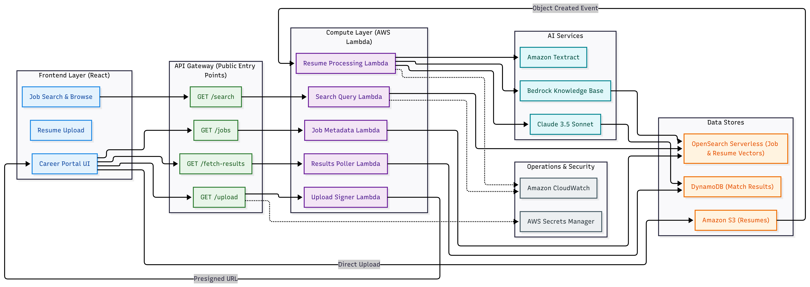
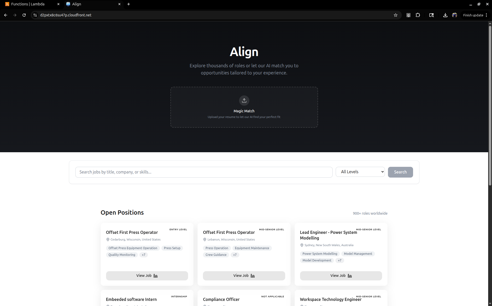
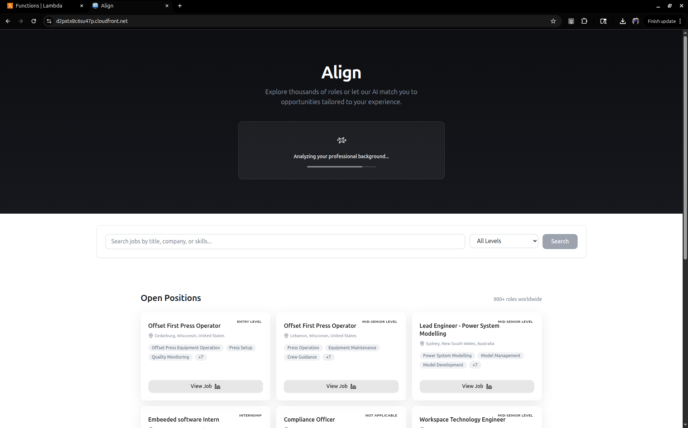
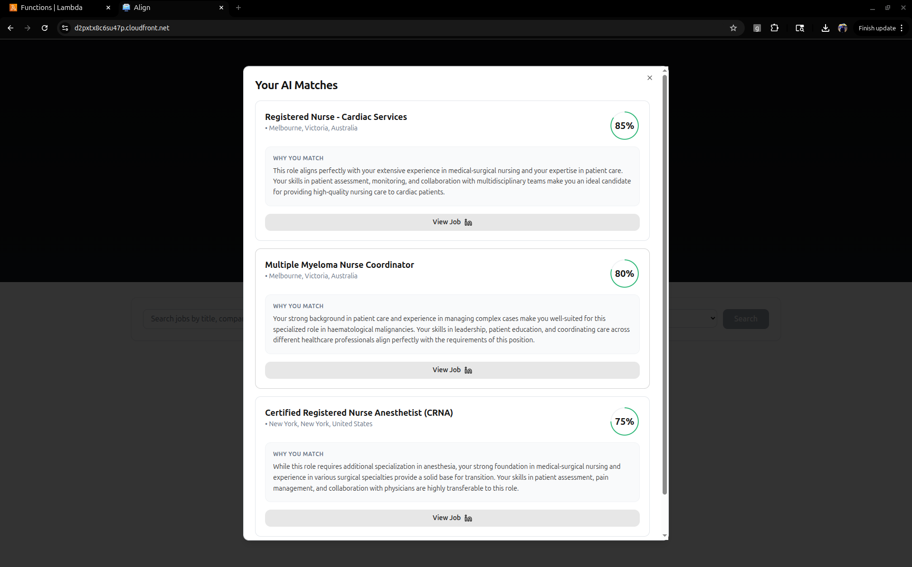

# align
align is an AI-powered job-search platform designed to provide lightning-fast search and filtering capabilities across job postings. It leverages high-performance vector search to connect candidates with the most relevant roles based on their resumes. By integrating modern cloud-native services, the platform offers a seamless, secure, and responsive user experience for high-volume job discovery.

## AWS Components Used

* **Frontend Hosting:** Amazon S3 and Amazon CloudFront (HTTPS/SSL).
* **API Layer:** Amazon API Gateway 
* **Compute:** AWS Lambda (Python-based serverless functions).
* **Search Engine:** Amazon OpenSearch Serverless (AOSS).
* **Data Source:** Amazon Bedrock Knowledge Base (for vector indexing).
* **State management:** DynamoDB
* **Job Metadata Store:** S3

## Architecture and Components

## User Interface and Functioning
#### Landing page with job postings and search feature

#### Uploading a resume of a nurse

## Why Lambda & Scaling?

The system is built on **AWS Lambda** to ensure a 100% serverless compute layer that scales automatically as user traffic fluctuates.

* **Horizontal Scaling:** Lambda handles thousands of concurrent search requests without needing manual server management.
* **Pagination:** By implementing `from` and `size` logic, the system only processes small chunks of data (12 jobs at a time), preventing memory overloads and keeping latency low despite any scale.
* **OpenSearch Serverless:** The search backend scales compute and storage independently, ensuring that indexing thousands of jobs don't slow down the retrieval speed for users.

## RAG & Claude 3.5 Sonnet Integration

The architecture implements **Retrieval-Augmented Generation (RAG)** to provide intelligent resume matching.

* **Retrieval:** When a resume is uploaded, the system uses OpenSearch to retrieve the top matching jobs based on vector embeddings.
* **Generation:** These results are then fed to **Claude 3.5 Sonnet** (via Amazon Bedrock) to generate a personalized explanation of why the candidate is a fit for those specific roles. This also ensures better matching based on the experience and skills of a user. 

## Deployment & Tech Stack

* **Backend:** Python 3.14
* **Frontend:** React (Vite) deployed via an **S3 + CloudFront** pipeline.
* **Security:** Multi-layer security featuring **IAM Identity Policies** and **AOSS Data Access Policies** to enforce the principle of least privilege.

## Future Scope

* **Elasticache Implementation:** To further reduce costs and latency, **Amazon ElastiCache (Redis)** can be implemented to store results for common search queries (e.g., "Software Engineer in NYC"), avoiding redundant hits to the OpenSearch index.
* **Hash Mechanism to identify same file upload:** Return previous matches to users when the same resume document has been uploaded or similar text extracts. 
* **Real-time Notifications:** Integrating **AWS SNS/SQS** to alert users immediately when a new job matching their uploaded resume is indexed.
* **Advanced Analytics:** Using **Amazon QuickSight** to visualize user profile trends and candidate match rates.

### Notes:
- The job postings have been retrieved from LinkedIn job posting scraper by APIfy. Adzuna was evaluated as well but the former provided with more attributes per job posting. 
- The script in `backend/scripts/s3_bucket_push.py` is used to push the APIFy job postings JSON to S3 separated by description and metadata. 
- Amazon Bedrock Knowledge Base helps in "searchable" embeddings. Needs syncing to AOSS when there is a change. Amazon Titan Text Embeddings V2 model has been used. 
- AOSS helps in fast retrieval.
